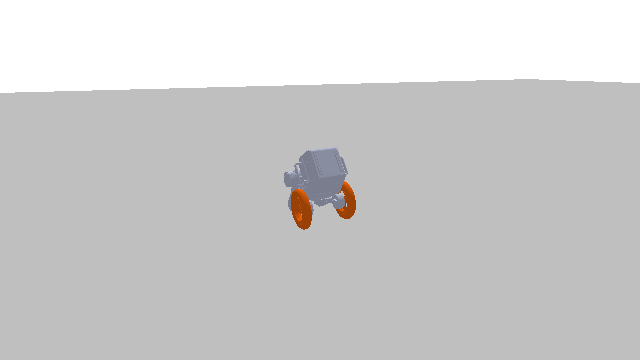

# Robust Wheeled Bipedal Locomotion

Hierarchical NMPC with a Super-Twisting Sliding Mode fast layer and Whole Body Control for a wheeled bipedal robot (LimX TRON-1A), with a unified Monte Carlo robustness campaign runner.

## Overview

This implementation features:
- **Hierarchical control**: NMPC layer (40 Hz) + STSMC fast layer (400 Hz) + Whole Body Control
- **Integral sliding mode correction**: Super-twisting auxiliary wrench on the NMPC prediction, with anti-windup back-calculation
- **DOB baseline**: Disturbance-observer variant sharing the same sliding surface, for comparison
- **Monte Carlo campaigns**: Three scenario families with randomised trial parameters, run in parallel with rolling CSV output

## Demo



*TRON-1A recovering from a 100 N lateral push while tracking 1.5 m/s*

## Scenarios

- **impulse**: Lateral push (90–110 N, 0.2 s) at randomised time and direction, with randomised friction, actuator gain loss, and sensor noise
- **terrain**: Randomised rough heightfield patch (5–15 cm bumps) with scaled friction
- **degradation**: Derated left wheel and both knees plus Coulomb joint friction, steady-state error metrics

## Requirements

**System:**
- Python 3.8+
- Ubuntu 20.04+ (or equivalent Linux distribution)

**Python Packages:**
- numpy, scipy, pandas, matplotlib
- casadi
- pybullet
- pin (Pinocchio)
- acados_template

## Usage
```bash
# Full campaign (scenario/mode defaults set at the top of run_controller.py)
python3 run_controller.py

# Full campaign for a specific scenario
python3 run_controller.py --scenario impulse

# Nominal (paper) scenario, one run per controller, with plots
python3 run_controller.py --scenario degradation --nominal

# Watch a single trial in the GUI
python3 run_controller.py --scenario impulse --watch 0 nmpc_stsmc

# Play the nominal scenario with every controller, GUI
python3 run_controller.py --scenario terrain --watchall 0

# Quick sanity run / determinism check
python3 run_controller.py --smoke
python3 run_controller.py --check-determinism

# Custom campaign
python3 run_controller.py --scenario terrain --n 50 --procs 4 \
    --controllers nmpc nmpc_stsmc --out my_run.csv --tag test
```

## File Structure

- `run_controller.py` - Unified three-scenario campaign runner, progress/tally printing, summaries, paper figures
- `controller.py` - Simulation stack: acados NMPC formulation, STSMC/DOB fast layer, WBC torque mapping, trial execution and metrics
- `TRON1A/WF_TRON1A/urdf/` - Robot URDF and mesh files

## Key Parameters

### Control Configuration (controller.py)
```python
N = 10                 # Prediction horizon steps
Tf = 0.25              # Horizon length (s)
dt_control = 0.025     # NMPC timestep (40 Hz)
dt_physics = 0.0025    # Physics/fast-layer timestep (400 Hz)
target_vx = 1.5        # Reference forward velocity (1.0 for terrain)
```

### Controller Arms (run_controller.py)
- **nmpc**: Baseline NMPC + WBC
- **nmpc_stsmc**: Proposed, STSMC fast layer at 400 Hz
- **nmpc_stsmc_200 / _80 / _40**: STSMC at reduced update rates
- **nmpc_dob**: Disturbance-observer fast layer
- **nmpc_stsmc_simplewbc**: STSMC with simplified WBC (no feedforward/Coriolis terms)

## Metrics

- **impulse**: Peak roll/pitch/yaw error, RMS velocity error, attitude recovery time (both attitude errors < 0.1 rad held 0.5 s after pulse end), fall rate, friction-cone violations
- **terrain**: Peak/RMS tracking errors measured from the rough patch onward, fall rate
- **degradation**: Signed steady-state errors and equilibrium lean angle over the shaded window (t ≥ 6 s)

Summaries report mean ± std over all and non-fall trials, plus pairwise common-survivor comparisons.
